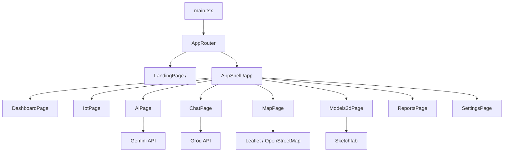
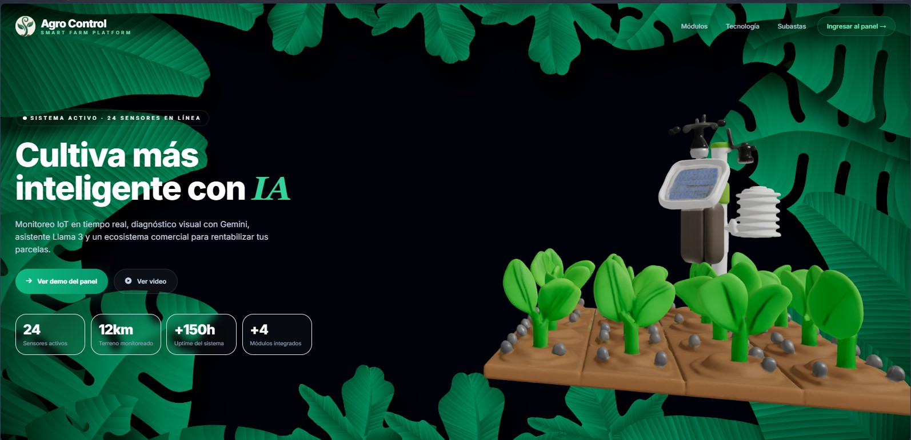
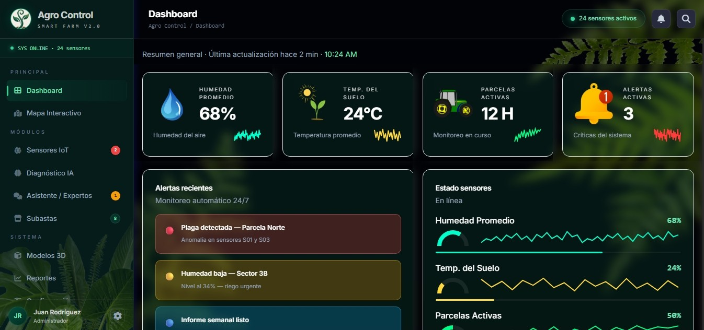

# Agro Control

Plataforma web de agricultura inteligente construida con React, Vite y TypeScript. El proyecto combina monitoreo IoT, un mapa interactivo de parcelas, diagnóstico visual con IA, chat asistido por Groq, visualización 3D y una interfaz pensada para operación diaria en campo.

## Qué resuelve

Agro Control centraliza las tareas más comunes de una finca o explotación agrícola en una sola interfaz:

- visualizar el estado general del cultivo en un dashboard unificado
- revisar sensores, alertas y métricas operativas
- analizar imágenes de plantas con Gemini para obtener un diagnóstico inicial
- consultar un asistente conversacional sobre la plataforma y su uso
- explorar parcelas en un mapa interactivo
- abrir modelos 3D y recursos visuales del proyecto
- simular un marketplace y módulos de negocio asociados al ecosistema

## Arquitectura

La aplicación sigue una arquitectura de SPA con layout persistente:

1. `src/main.tsx` monta la aplicación dentro de `BrowserRouter`.
2. `src/routes/AppRouter.tsx` define la navegación principal.
3. `src/components/layout/AppShell.tsx` actúa como contenedor de navegación, encabezado, menú lateral y navegación móvil.
4. Las páginas viven en `src/pages/` y resuelven cada módulo funcional.
5. Los servicios externos están aislados en `src/services/`.

### Flujo de navegación

- `/` muestra la landing pública.
- `/app` carga el shell de la aplicación.
- `/app/dashboard` es la vista inicial del panel.
- Desde el panel se navega a IoT, IA, chat, mapa, modelos 3D, reportes, marketplace y configuración.

### Diagrama general



## Módulos principales

### Landing

La portada presenta la propuesta de valor, métricas resumidas y accesos directos al panel. Está diseñada como una pieza comercial y visualmente más expresiva que el resto del sistema.

### Dashboard

Resume estado general, alertas recientes, sensores y accesos rápidos a módulos relevantes. Está pensado como punto de entrada operativo para el usuario diario.

### IoT

Agrupa lecturas de sensores, tarjetas de estado y tablas de monitoreo. Es el espacio para seguimiento de humedad, temperatura y condiciones del terreno.

### Diagnóstico IA

Permite subir o tomar una imagen de una planta, enviarla a Gemini y recibir un informe estructurado. También guarda historial local y permite exportar resultados.

### Chat

Ofrece un asistente contextual con Groq. Tiene varios hilos temáticos para soporte general, cultivos, suelos y plagas.

### Mapa

Usa Leaflet para mostrar parcelas, límites, centroide, estados y una vista más geográfica del terreno.

### Modelos 3D

Presenta modelos embebidos desde Sketchfab para enriquecer la visualización del proyecto y abrir activos 3D de referencia.

### Reports, Marketplace y Settings

Completan la experiencia con reportes, simulación de negocio y configuración básica de perfil y umbrales.

## Funciones destacadas

- navegación responsive con menú lateral y barra inferior móvil
- dashboard con tarjetas métricas y alertas
- diagnóstico visual con historial local y exportación a texto
- chat por IA con contexto del proyecto
- mapa interactivo de parcelas
- vista 3D con carga diferida
- PWA con `vite-plugin-pwa`

## Tecnologías y Dependencias Clave

El proyecto está construido sobre un ecosistema moderno de frontend, utilizando las siguientes librerías principales (ver `package.json` para versiones específicas):

- **Core:** React 18, TypeScript, Vite
- **Estilos:** Tailwind CSS, Autoprefixer
- **Enrutamiento:** React Router DOM v7
- **Mapas y Geoespacial:** Leaflet, React Leaflet, Turf.js
- **Modelos 3D:** Three.js, `@react-three/fiber`, `@react-three/drei`, `@splinetool/runtime`
- **Gráficos y Datos:** Recharts, TanStack React Query
- **Exportación:** jsPDF, xlsx
- **PWA:** `vite-plugin-pwa`
- **IoT:** MQTT.js

## Variables de entorno

Para ejecutar el proyecto localmente, es necesario configurar un archivo `.env` en la raíz del proyecto. Puedes basarte en el archivo `.env.example` provisto:

```env
# Configuración de Groq (Asistente Chatbot)
VITE_GROQ_API_KEY=tu_api_key_de_groq
VITE_GROQ_MODEL=llama-3.3-70b-versatile
VITE_GROQ_MAX_COMPLETION_TOKENS=512
VITE_GROQ_TEMPERATURE=0.15

# Configuración de Gemini (Diagnóstico de Plantas)
# El sistema soporta múltiples keys para rotación automática y evitar rate limits
VITE_GEMINI_API_KEY_1=tu_api_key_de_gemini_1
VITE_GEMINI_API_KEY_2=tu_api_key_de_gemini_2
VITE_GEMINI_MODEL=gemini-2.5-flash
```

## Servicios externos

- Groq para chat conversacional
- Gemini para diagnóstico de imágenes
- OpenStreetMap para el mapa
- Sketchfab para modelos 3D

## Ejemplos de integración de Endpoints

Agro Control opera principalmente como una SPA. En lugar de un backend tradicional, se integra de forma directa ("Serverless-like") con las siguientes APIs externas:

### Diagnóstico con Gemini AI (`src/services/geminiDiagnosis.ts`)

Se envía la imagen capturada en Base64 junto con un prompt agronómico estructurado al modelo multmodal de Google.

**Endpoint:** 
`POST https://generativelanguage.googleapis.com/v1beta/models/{VITE_GEMINI_MODEL}:generateContent?key={API_KEY}`

**Payload de la petición:**
```json
{
  "contents": [
    {
      "role": "user",
      "parts": [
        { "text": "Eres un especialista en fitopatología..." },
        {
          "inlineData": {
            "mimeType": "image/jpeg",
            "data": "<BASE_64_STRING>"
          }
        }
      ]
    }
  ],
  "generationConfig": {
    "temperature": 0.2,
    "topP": 1,
    "maxOutputTokens": 512
  }
}
```

### Chatbot con Groq (`src/services/groqChat.ts`)

Se mantiene el contexto de la conversación (hilo activo, perfil, métricas del entorno) y se procesa mediante Llama 3 vía la API compatible con OpenAI de Groq.

**Endpoint:** 
`POST https://api.groq.com/openai/v1/chat/completions`

**Headers requeridos:**
- `Authorization: Bearer {VITE_GROQ_API_KEY}`
- `Content-Type: application/json`

**Payload de la petición:**
```json
{
  "model": "llama-3.3-70b-versatile",
  "messages": [
    {
      "role": "system",
      "content": "Eres un asistente senior integrado en la plataforma Agro Control..."
    },
    {
      "role": "user",
      "content": "Muéstrame las alertas recientes en el sector Norte."
    }
  ],
  "temperature": 0.15,
  "max_completion_tokens": 512,
  "top_p": 1,
  "stream": false
}
```

## Scripts

- `npm install` instalación de dependencias del proyecto
- `npm run dev` inicia el servidor de desarrollo
- `npm run build` genera la compilación de producción
- `npm run preview` sirve la versión compilada

## Estructura del proyecto

```text
src/
	components/
	config/
	pages/
	routes/
	services/
	types/
	utils/
public/
documents/
```

## Imágenes del proyecto

Las siguientes imágenes forman parte de la documentación visual del proyecto:

### Landing



### Dashboard



## Propósito del proyecto

Agro Control está orientado a mostrar cómo una plataforma agrícola puede unificar monitoreo, diagnóstico, asistencia y visualización en una sola experiencia moderna.